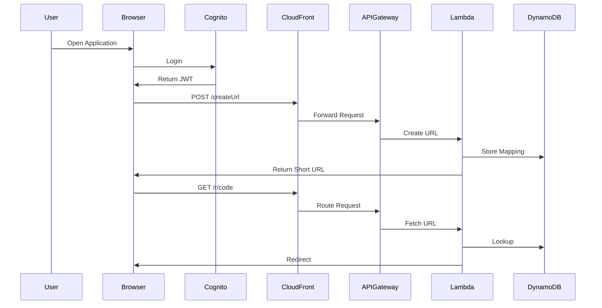

# Designing a Disciplined Serverless URL Platform

---

## A Production‑Ready Architecture and Deployment Strategy

---

## Executive Summary

This document presents the architecture, deployment strategy, and operational model for a fully serverless URL shortener built on AWS and provisioned using Terraform.

The system demonstrates:

- domain-agnostic architecture
- feature flag-driven infrastructure lifecycle
- runtime configuration injection
- CI/CD controlled deployments
- strong separation between infrastructure and application logic

<a href="https://github.com/abhinavcloud/shortURL" target="_blank">Link to GitHub repository</a>


---

## Problem Statement

The objective is to design an infrastructure system that can be deployed consistently across environments, adapt to different domains without modification, and evolve without introducing hidden dependencies or configuration drift.
In most implementations, infrastructure and configuration become tightly coupled over time. Domain values, API endpoints, and environment-specific settings are embedded into code or Terraform definitions. Deployment workflows begin to diverge, and infrastructure behavior becomes dependent on implicit assumptions rather than explicit configuration.
This results in systems that are:

- not easily reproducible across environments
- difficult to promote from one stage to another
- sensitive to small configuration changes
- prone to drift and inconsistent behavior

The desired end state is an infrastructure model where:

- configuration is fully externalized
- deployments are driven entirely through CI/CD
- infrastructure definitions remain environment-agnostic
- dependencies are explicitly controlled
- lifecycle constraints are managed without manual intervention

This system addresses these issues by:

- injecting all runtime configuration through CI/CD workflows
- introducing feature flags to manage phased infrastructure changes
- separating infrastructure, configuration, and application concerns
- enforcing a single deployment pathway across environments

The result is an infrastructure setup that is predictable, reusable, and controlled, without relying on environment-specific assumptions or manual adjustments.

---

## Architectural Goals

From the outset, the following constraints were enforced:

- No hardcoded environment configuration in code
- Domain and API values injected at deployment time
- Infrastructure controlled entirely via Terraform
- Feature flags used to manage lifecycle dependencies
- CI/CD as the single source of truth for deployment
- Frontend and backend configuration strictly decoupled

These constraints dictated the architecture.

---

## High-Level Architecture

The goal of this architecture is to establish an infrastructure system that can be deployed consistently across environments, adapt to different domains without modification, and operate with fully controlled configuration and lifecycle management.
The system is designed to achieve the following:

- Ensure all configuration is external to infrastructure code and injected at deployment time
- Enable infrastructure definitions that are reusable and domain-agnostic
- Maintain consistent and repeatable deployments across all environments
- Ensure all integrations and dependencies are explicitly defined and controlled
- Support controlled infrastructure evolution using feature flags for phased changes
- Maintain a clear separation between infrastructure, configuration, and application layers
- Enforce CI/CD as the single mechanism for provisioning and changes
- Ensure infrastructure changes are predictable, observable, and reproducible

The resulting system allows infrastructure to behave consistently across environments, adapt to new configurations without code changes, and evolve without introducing hidden dependencies or deployment uncertainty.


---


## Design Strategy: Configuration is External

The design strategy focuses on establishing an infrastructure model where configuration, deployment, and system behavior remain fully controlled and independent of code changes.

The system is designed using the following approach:

- All environment-specific values are defined outside the infrastructure code and injected during deployment
- Infrastructure definitions are written to be fully reusable across environments without modification
- Deployment workflows are centralized, ensuring all changes are introduced through CI/CD with a consistent execution path
- Lifecycle dependencies, such as certificate validation and domain attachment, are managed using feature flags to allow phased and controlled changes
- Runtime configuration required by the application is generated dynamically during deployment rather than embedded in source code
- Integration points between services are explicitly defined through Terraform outputs and variables to avoid implicit coupling
- CloudFront is used as a single routing layer to separate frontend delivery and backend execution without exposing underlying services

The resulting design enables infrastructure to adapt to different environments and domains without changes to code, while ensuring deployments remain predictable, controlled, and repeatable across all stages.

---

## Feature Flag Strategy

Infrastructure lifecycle dependencies are handled using feature flags.

variable "enable_custom_domain" {
  type = bool
}

---

## Deployment Flow

Phase 1
- Deploy with flag disabled
- Certificate created
- Validation records generated

Phase 2
- DNS validation completed externally

Phase 3
- Deploy with flag enabled
- Certificate attached to CloudFront

---

## Runtime Configuration Injection

window.APP_CONFIG = {
  API_URL: "<injected>",
  COGNITO_DOMAIN: "<injected>",
  CLIENT_ID: "<injected>",
  REDIRECT_URI: "<injected>"
}

---

## Terraform Resources

### CloudFront

CloudFront serves as the single entry point for all incoming traffic, routing requests between frontend assets and backend APIs based on path patterns.

```hcl
resource "aws_cloudfront_distribution" "site" {
  enabled             = true
  default_root_object = "index.html"

  aliases = var.enable_custom_domain ? [var.root_domain] : []

  origin {
    domain_name              = var.bucket_regional_domain_name
    origin_id                = "s3-${var.bucket_name}"
    origin_access_control_id = aws_cloudfront_origin_access_control.site_oac.id
  }

  origin {
    domain_name = local.apigw_domain_name
    origin_id   = "apigw-shorturl"
    origin_path = local.apigw_origin_path

    custom_origin_config {
      origin_protocol_policy = "https-only"
    }
  }

  ordered_cache_behavior {
    path_pattern     = "/r/*"
    target_origin_id = "apigw-shorturl"
  }

  default_cache_behavior {
    target_origin_id = "s3-${var.bucket_name}"
  }
}
```

### S3

S3 hosts the frontend and is kept private.

```hcl
resource "aws_s3_bucket" "site" {
  bucket        = "shorturl-website-landing-page"
  force_destroy = true
}
```

### API Gateway

Handles backend routing.

```hcl
resource "aws_apigatewayv2_api" "shorturl" {
  name          = "serverless_shorturl_gw"
  protocol_type = "HTTP"
}
```

### Lambda

Executes business logic.

```hcl
environment {
  variables = {
    TABLE_NAME  = var.dynamodb_table_name
    DOMAIN_NAME = var.domain_name
  }
}
```

```python
domain = os.environ["DOMAIN_NAME"]
short_url = f"{domain}/r/{short_code}"
```

### DynamoDB

Stores URL mappings.

```hcl
resource "aws_dynamodb_table" "short_urls" {
  hash_key = "short_code"
}
```

### Cognito

Handles authentication.

```hcl
allowed_oauth_flows = ["code", "implicit"]
```

### ACM and Feature Flag

```hcl
viewer_certificate {
  cloudfront_default_certificate = var.enable_custom_domain ? false : true
}
```

### CI/CD

```yaml
env:
  TF_VAR_domain_name: ${{ secrets.domain_name }}
```

```yaml
cat > config.js <<EOF
window.APP_CONFIG = { API_URL: "..." };
EOF
```

---

## Sequence Diagram



---

## Security Model

- Private S3 with OAC
- JWT-authorized API
- IAM least privilege
- No credentials in code

---

## Operational Observations

- Feature flags control lifecycle
- Config injection prevents drift
- Routing stays centralized

---

## Conclusion

This system demonstrates how infrastructure can be designed to operate with predictability, controlled configuration, and repeatable deployment behavior, independent of environment-specific assumptions.
By externalizing all configuration, enforcing CI/CD as the single deployment path, and managing lifecycle dependencies through feature flags, the architecture ensures that infrastructure remains consistent across environments and adaptable without modification to code.
Each component is deployed with a clearly defined responsibility and explicit boundaries, enabling requests, configuration, and access paths to remain fully controlled. This approach removes implicit behavior and ensures that changes are introduced deliberately rather than incidentally.
The result is an infrastructure model that can be reused across environments and domains, scaled without modifying core definitions, and evolved without introducing hidden dependencies or inconsistencies.
The system remains intentionally simple in functionality.
Its value lies in how consistently and predictably it behaves under change.